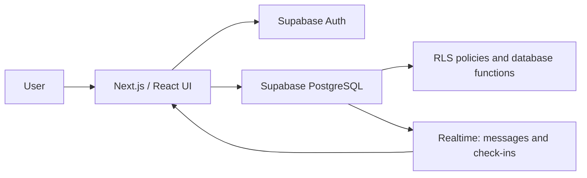

# Scrimnet

[](https://github.com/CadeSchiano/collegiate-scrims/actions/workflows/ci.yml)

> A practice-first platform for verified collegiate Rocket League teams to find, schedule, and coordinate scrims.

Scrimnet replaces fragmented Discord messages with a structured workflow for collegiate Rocket League practice. Teams can create a roster, complete manual verification, post or request a scrim, and coordinate privately once a match is confirmed.

It is intentionally not a ranked competitive platform. Scrimnet does not include rankings, ladders, tournament standings, scores, public win/loss records, or player performance statistics.

## Live demo

The current beta deployment is available at [scrimnet.vercel.app](https://scrimnet.vercel.app).

## Screenshots

No screenshots are committed yet so the repository does not present stale or fabricated product views. See [docs/screenshots/README.md](docs/screenshots/README.md) for the exact screens to capture and where to place them.

## Core features

- Email/password account creation and sign-in through Supabase Auth
- Collegiate team creation, manual verification, and captain/manager/member roster roles
- Team invitations by Scrimnet username with in-app notifications, or by a shareable email invite link
- A verified-team marketplace for future Rocket League scrim listings
- Scrim posting, request submission, acceptance, and decline workflows
- Private confirmed-match workspace with realtime match chat and team check-in
- Reschedule proposals, cancellation handling, and replacement-opponent listings
- Completed-scrim and no-show workflows with private reliability summaries
- Private match reports and an admin queue for team verification and moderation

## Tech stack

- [Next.js](https://nextjs.org/) and [React](https://react.dev/)
- [Supabase](https://supabase.com/) for Auth, PostgreSQL, Row Level Security (RLS), and Realtime
- CSS for the responsive interface
- [Vercel](https://vercel.com/) for the beta deployment and analytics
- Node's built-in test runner, ESLint, Prettier, and GitHub Actions for engineering checks

## Architecture

Scrimnet is a client-rendered Next.js application. Browser components use the Supabase JavaScript client; Supabase Auth manages sessions, PostgreSQL stores application data, and RLS plus database functions enforce data boundaries.



There are no Next.js API routes or server actions in the current implementation. The important authorization and lifecycle rules live in the Supabase schema, RLS policies, and `security definer` database functions under `supabase/migrations/`.

## Primary workflow

```text
Create account
→ Create or join a team
→ Manual team verification
→ Post or find a scrim
→ Request and accept a matchup
→ Coordinate in the private workspace
→ Check in
→ Complete, cancel, replace, or report a no-show
```

## Database and authorization model

The central relationships are:

- A Supabase Auth user receives a `profiles` row.
- Teams belong to schools and have a captain plus team-membership rows for their roster.
- Scrims have a posting team and, after acceptance, an opponent team.
- Scrim requests, check-ins, reschedule proposals, cancellations, outcomes, messages, and reports connect to that workflow.

The database uses RLS and narrowly scoped database functions to enforce the workflow. In particular:

- School-directory reads are public so the team-creation form can load choices.
- Approved, non-suspended teams are required to post or request marketplace scrims.
- A captain or manager is required for privileged team and scrim actions.
- Only participating team members (and admins) can read confirmed-match messages, check-ins, reschedule proposals, and outcomes.
- Match messages require the signed-in sender to be a participant.
- Admin verification and report moderation are based on the `profiles.is_admin` flag and RLS policies.

RLS is a key boundary, not a claim of a formal security audit. Read the migrations before changing policies or adding a new data-access path.

## Project structure

```text
app/                    Next.js routes and page-level UI
components/             Shared navigation and notification components
lib/                    Supabase client and small application utilities
supabase/migrations/    Ordered PostgreSQL schema, RLS, and workflow migrations
tests/                  Deterministic lifecycle unit tests
.github/workflows/      Continuous-integration workflow
docs/screenshots/       Screenshot capture guide and future repository images
```

## Local development

Requirements: Node.js 20+ and npm.

```bash
npm install
cp .env.example .env.local
npm run dev
```

Open [http://localhost:3000](http://localhost:3000).

### Environment variables

| Variable                               | Purpose                                         |
| -------------------------------------- | ----------------------------------------------- |
| `NEXT_PUBLIC_SUPABASE_URL`             | Supabase project URL used by the browser client |
| `NEXT_PUBLIC_SUPABASE_PUBLISHABLE_KEY` | Supabase browser publishable/anon key           |

Only browser-safe Supabase values belong in these variables. Never commit a database password, service-role key, or any other server secret.

## Database setup

This repository currently applies database changes through the Supabase SQL Editor rather than a configured Supabase CLI project.

1. Create a Supabase project.
2. Run the files in `supabase/migrations/` in filename order.
3. Configure Supabase Auth's Site URL and redirect URLs for local development and the deployment URL.
4. If email confirmation is required, enable **Confirm Email** in Supabase Auth's Email provider and configure an SMTP provider before inviting external testers.
5. Mark the intended administrator account by setting its `profiles.is_admin` value through the Supabase dashboard/SQL Editor.

The migrations create the schema, RLS policies, Realtime publication entries, school directory, and database functions used by the application. Apply new migrations to the production project before relying on the associated code change.

## Quality checks

```bash
npm run format:check
npm run lint
npm test
npm run build
```

The tests cover the deterministic client-side lifecycle gates used by the match workspace: the check-in window, requirements for completing a scrim, and requirements for reporting a no-show. Database functions and RLS policies remain the authoritative enforcement layer and should be tested in a Supabase environment when those migrations change.

GitHub Actions runs formatting, linting, tests, and a production build on pushes and pull requests. Its build uses safe placeholder environment values and does not contact the production Supabase project.

## Product guardrails

See [PRODUCT_GUARDRAILS.md](PRODUCT_GUARDRAILS.md) for the permanent scope policy. Reliability information—check-ins, completed practices, late cancellations, and no-shows—is allowed because it helps teams schedule dependable practice. Competitive-status features are intentionally out of scope.

## Current status

The beta supports the full core practice workflow from team creation through match closeout, plus roster invitations, moderation, and deployment analytics. Email invitations currently create a private link for a captain or manager to share; Scrimnet does not yet send outbound invitation emails itself.

Before expanding beyond a controlled beta, priorities include broader school-directory coverage, mobile QA, an operational process for verification/moderation, and any desired outbound email provider integration.

## License

No open-source license has been selected. The source is currently all rights reserved; making the repository public does not grant permission to reuse it. Choose and add a license only if you want to grant specific reuse rights.
